Support Hardware and Firmware
=============================

Espressif maintains their ESP-AT project currently for a number of
hardware platforms, mainly ESP32C2, ESP32C3, ESP32C6, ESP32-S2 and
ESP32. Support for older hardware (ESP8266) is limited and the
available firmware source is only maintained up to version
2.x.x.x. (currently 2.3.0.0).

Hardware Overview
-----------------

  - ESP32C3: **Fully supported, highly recommended, first choice**. 
    Boards with an ESP32C3 are small and cost-efficient and widely available.
  - ESP32C6: **Fully supported, recommended, second choice**. 
    Bigger and not as cost-efficient as ESP32C3 boards, but they
    support WIFI6.
  - ESP32-S2: **Fully supported, recommended, second choice**. 
  - ESP32: **Fully supported, not recommended**. 
    ESP32 based boards are usually larger and more expensive than ESP32C3 boards.
  - ESP-01S: **Partly supported, not fully recommended** 
    These are very cheap and small boards, but they only support the operation
    as a TCP/SSL/UDP client and TCP server (no SSL). Also, you have to build
    your own firmware (see
    [ESP-01S Firmware Compile Guide](./at_firmware_compile_esp01s.md))

Firmware
--------

Official, released firmware is available from
<https://docs.espressif.com/projects/esp-at/en/latest/esp32c3/Get_Started/Downloading_guide.html> (replace the 'esp32c3' in the link with your platform).
You can also go to the 'Releases' page of the Espressif ESP-AT project:
<https://github.com/espressif/esp-at/releases>.

As of this writing, Espressif released v4.1.1.0 for most platforms
(v2.3.0.0 for ESP8266). Some features added with v4.1.0.0 are supported
starting with version 1.2.0 of the circuitpython-esp32at library.

The downloaded zip-file has a folder called "factory", and in this
folder is a combined binary firmware that has to be flashed to address 0x0.

Flashing the firmware is a one-time task and documented in
<https://docs.espressif.com/projects/esp-at/en/latest/esp32c3/Get_Started/Downloading_guide.html#flash-at-firmware-into-your-device>.

The modules of this repository have been tested with the following
firmware versions:

  - v4.1.1.0 (ESP32C3)
  - v3.4.0.0 (ESP32, ESP32C6, ESP32-S2)
  - v4.0.0.0 (ESP32C6)
  - v2.3.0.0 (ESP8266)

Older versions (1.x.x, often pre-installed on ESP8266-devices) will
definitely not work.

Starting with v3.3.0.0, there are no major relevant differences
between the firmware versions, but new features and options are
added. **Since Espressif tries to be backward compatible, it is
recommended to run the most current release of the AT-firmware
available for the given platform.**

The downladed factory firmware can be changed with the [at.py
utility](https://github.com/espressif/esp-at/blob/master/tools/at.py)
provided by Espressif. This is useful for changing settings like the
default pins or the country code used by the firmware. You will find
some examples in the board specific notes below.

As an alternative, you can compile your own firmware using the
[Firmware Compile Guide](./at_firmware_compile.md).

Board-specific Notes
====================

The boards below have all been tested. This does not imply that other
boards don't work.

Qt-Py ESP32C3
-------------

This product from Adafruit (shop:
[Adafruit Qt-Py ESP32C3](https://www.adafruit.com/product/5405)) is
small and works with the stock ESP32C3 firmware (select the 'MINI-1'
variant).

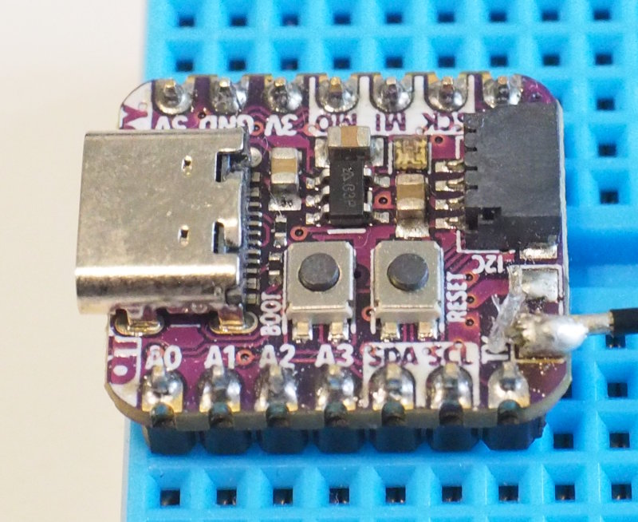

Pins:

  - RX: GPIO6 (labeled 'SCL')
  - TX: GPIO7 (labeled 'MO')
  - RST: n.a.

If this board does not connect to your AP, try reducing the TX power.

To connect the board using the Stemma/Qt connector, you have to modify
the firmware to use RX:GPI05 and TX:GPIO6:

    at.py modify_bin -tx 6 -rx 5 --cts_pin -1 --rts_pin -1 \
            -in ESP32C3-AT-Factory-Firmware-v3.3.0.0.bin \
            -o  ESP32C3-AT-Qtpy-Stemma-Firmware-v3.3.0.0.bin

This command takes the factory-firmware as input and creates a modified
firmware as output.

Notes:

  - **Never power the board from USB if connected to the main MCU
    using the Stemma/Qt connector**.
  - Powering by 3V3 might or might not work. This depends how stable
    the 3V3 line of the main MCU is and how much current it can provide.
  - The ESP32C3 peak current for 802.11g is 285mA at 100% duty-cycle at
    full TX-power. It will brown-out at 3.0V. The datasheet recommends
    a power-supply with at least 500mA.

ESP32C3-SuperMini
-----------------

The Super-Mini is probably the cheapest solution available. The problem
is the quality of the antenna. Some boards work perfectly fine, others
have problems connecting. Sometimes reducing the TX power helps.

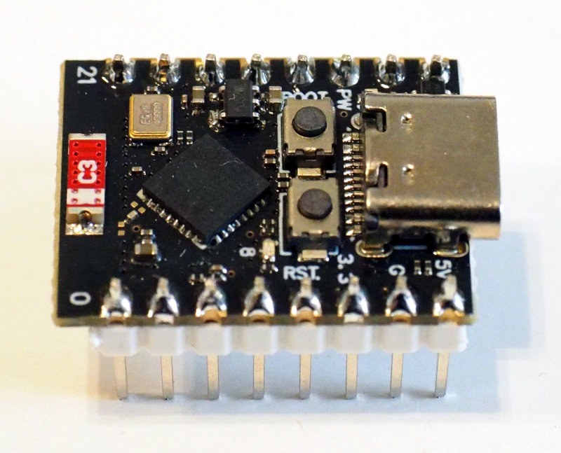

The boards work down to 3.3V, so they can be operated and powered by
the 3V3 pin of the MCU (unless some other power hungry devices are
connected).

Pins:

  - RX: GPIO6 (labeled '6')
  - TX: GPIO7 (labeled '7')
  - RST: n.a.

A small support PCB from <https://github.com/bablokb/pcb-esp32c3-adapter>
allows to connect to the SuperMini using a Stemma/Qt-cable. The power pin
of the Stemma/Qt is connected to 3V3 but a jumper on the back allows
switching this to the 5V pin.

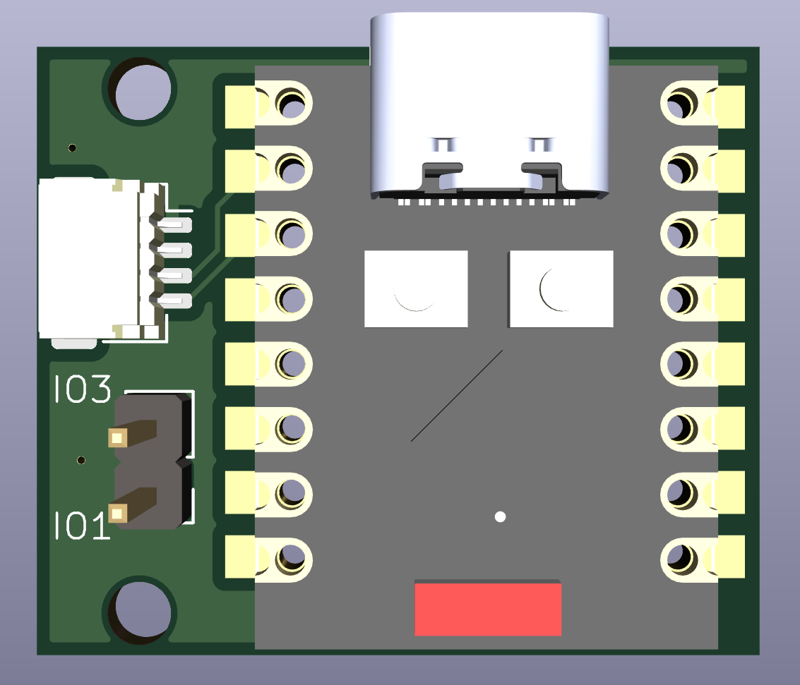

Since many boards allow to connect various peripherals to their pins,
the host MCU could also use Stemma if changing pin functions is possible.
The Pico together with a PiCowbell is an example. The standard I2C
pins of this interface (GP4 and GP5) can be repurposed as UART and
the SuperMini can then be connected using a simple Stemma/Qt cable.

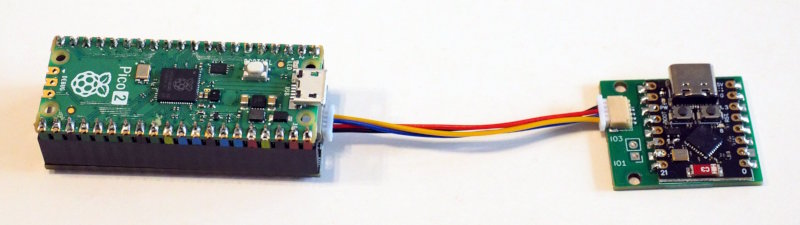

Notes:

  - **Never power the board from USB if connected to the main MCU
    using the Stemma/Qt connector**.
  - Powering by 3V3 might or might not work. This depends how stable
    the 3V3 line of the main MCU is and how much current it can provide.
  - The ESP32C3 peak current for 802.11g is 285mA at 100% duty-cycle at
    full TX-power. It will brown-out at 3.0V. The datasheet recommends
    a power-supply with at least 500mA.

Lilygo T-01 C3
--------------

The [Lilygo T-01 C3](https://www.lilygo.cc/products/t-01c3) is a
minimalistic C3-board. It has the same footprint and pinout as the
famous ESP-01S board.

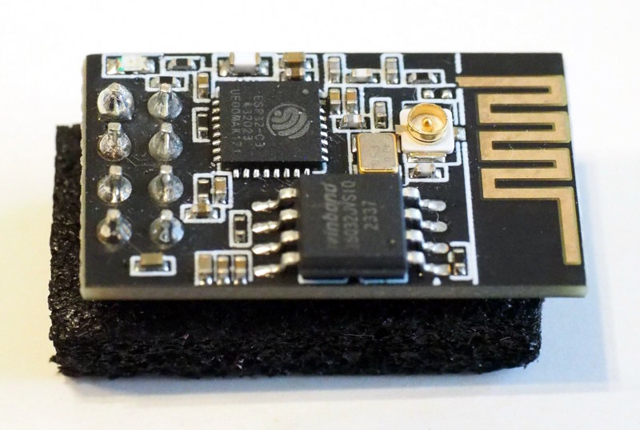

The device needs stable 3.3V. Otherwise, it works just fine and is the
best choice.

Pins (2x4 header):

  - RX: GPIO20 (labeled 'RXD', pin 4)
  - TX: GPIO21 (labeled 'TXD', pin 5)
  - RST: pin 7
  - IO2: pin 2
  - IO8: pin 6 (-> onboard LED, active high)
  - IO9: pin 3

Because the standard AT-command port pins are not available on the
device, some changes are necessary using the at.py utility:

    at.py modify_bin -un 0 -cc DE -tx 21 -rx 20 --cts_pin -1 --rts_pin -1 \
             -in ESP32C3-AT-Factory-Firmware-v3.3.0.0.bin \
             -o  lilygo-t01c3-at-firmware-3.3.1.0.bin

This command changes the AT-UART from UART1 to UART0 (using `-un 0`,
the country code (using `-cc DE`), and the RX/TX pins to
GPIO20/GPIO21.

Spotpear RP2040_ESP32C3
-----------------------

[This device](https://spotpear.com/index/product/detail/id/1355.html)
has a Pico formfactor and pinout and uses an ESP32C3 instead of the
CYW43-chip on the Pico-W as the WIFI-coprocessor.

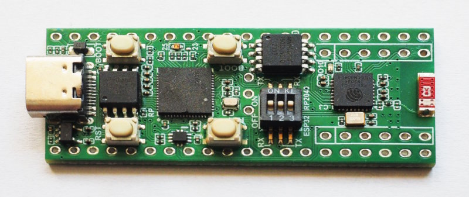

The board works perfect and is ideal as a development platform for this
library. Otherwise, it is just too expensive and it makes more sense
to use a Pico-W instead.

Besides the Pico-pins the device also breaks out a number of ESP32C3
pins. Pico and ESP32C3 are connected via UART:

  - RX: GPIO20 (connected to GP16 on the Pico)
  - TX: GPIO21 (connected to GP17 on the Pico)
  - RST: n.a.

A dip switch allows to connect the USB-C either to the RP2040, or
to the ESP32C3. This also connects the UART-pins to the USB-connector.

Since the standard AT-command port pins are not connected to the RP2040,
some changes are necessary using the at.py utility:

    at.py modify_bin -un 0 -cc DE -tx 21 -rx 20 --cts_pin -1 --rts_pin -1 \
             -in ESP32C3-AT-Factory-Firmware-v3.3.0.0.bin \
             -o  spotpear-at-firmware-3.3.1.0.bin

This command changes the AT-UART from UART1 to UART0 (using `-un 0`,
the country code (using `-cc DE`), and the RX/TX pins to
GPIO20/GPIO21.

Challenger+RP2350 Wifi6/BLE5
----------------------------

This is a Feather-sized, integrated solution with an ESP32C6, see
[Challenger+RP2350
Wifi6/BLE5](https://ilabs.se/challenger-rp2350-wifi-ble/).  Due to the
integration no extra cables are necessary. Highly recommended!

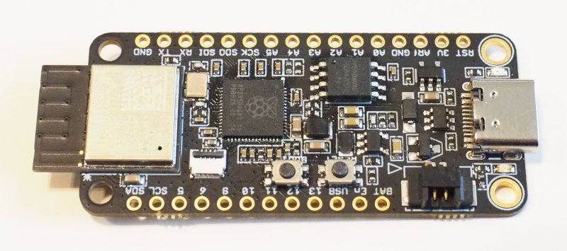

The Challenger has 8MB PSRAM and 8MB flash. The AT firmware for the
ESP32C6 is already installed.

For TX, RX and RST the `board`-module defines suitable pins:

  - RX:  `board.ESP_RX`
  - TX:  `board.ESP_TX`
  - RST: `board.ESP_RESET`

ESP32C6-Mini
------------

This is a minimal C6-board similar to the ESP32C3-SuperMini. It is
less common, a bit larger, and suffers from the same
quality-problems. Since it is also more expensive than the SuperMini
there is no reason to use this board unless you need WIFI6.

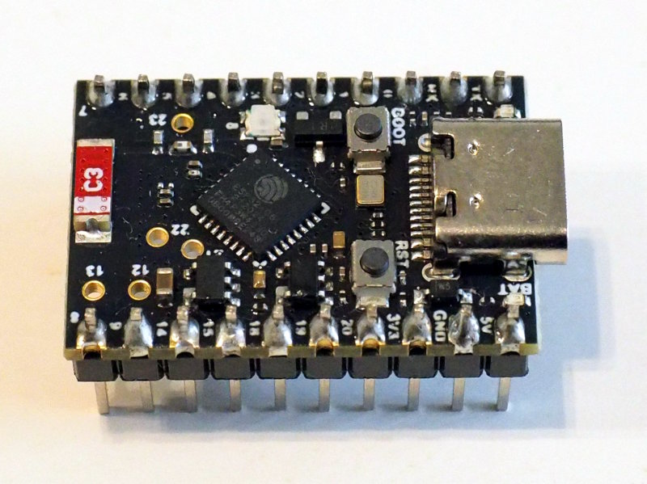

The board works with the standard factory firmware.

Pins:

  - RX: GPIO6 (labeled '6')
  - TX: GPIO7 (labeled '7')
  - RST: n.a.

MuseLab Nano-ESP32-C6
---------------------

[This
board](https://github.com/wuxx/nanoESP32-C6/blob/master/README_en.md)
is very large (despite the fact that it is called "nano") and
available with different flash-sizes. The board works fine but is not
recommended due to it's size.

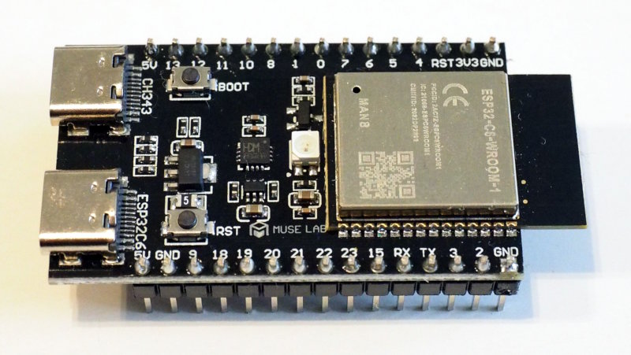

Pins:

  - RX: GPIO6 (labeled '6')
  - TX: GPIO7 (labeled '7')
  - RST: pin 3 on header left of ESP-chip

Wemos Lolin S2-Mini
-------------------

The [Lolin S2-Mini](https://www.wemos.cc/en/latest/s2/s2_mini.html) is
based on the ESP32-S2FN4R2 (4MB flash, 2MB embedded PSRAM). Wemos has
an official store at
[AliExpress](https://www.aliexpress.com/item/1005003145192016.html). You
will also find many cheaper clones on AliExpress, but users reported
problems with some of these clones (YMWV).

The board is fairly small and inexpensive, therefore suitable as a
co-processor (note that there is also native support for CircuitPython).

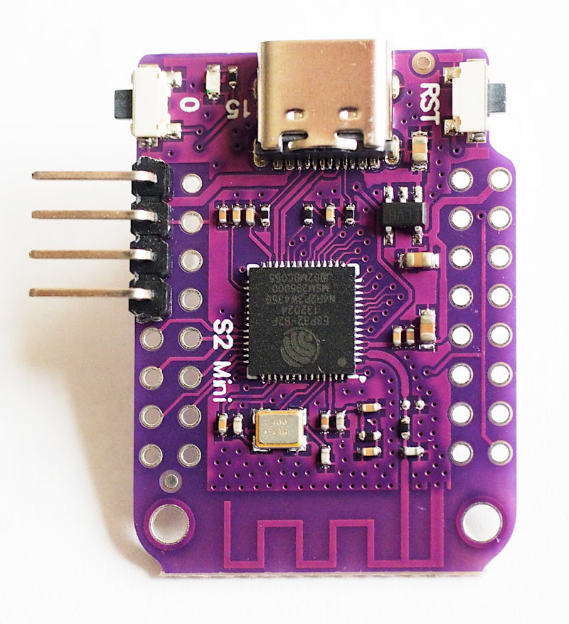

Pins:

  - RX: GPIO21 (labeled '21')
  - TX: GPIO17 (labeled '17')
  - RST: EN pin (labeled 'EN')

Notes:

  - **Never power the board from USB if connected to the main MCU**.
  - Powering by 3V3 might or might not work. This depends how stable
    the 3V3 line of the main MCU is and how much current it can provide.
  - The ESP32-S2 peak current for 802.11g is 220mA at 100% duty-cycle at
    15dBm TX-power. It will brown-out at 2.8V. The datasheet recommends
    a power-supply with at least 500mA.
  - Changing the RX/TX pins to GPIO16/GPIO18 will allow to attach a
    single 1x4 pin header for RX/TX/GND/VBUS (see image):

        at.py modify_bin -cc DE -tx 18 -rx 16 --cts_pin -1 --rts_pin -1 \
                 -in factory_MINI.bin \
                 -o  esp32s2-AT-Firmware-Lolin-s2-mini-v3.4.0.0.bin

DFRobot Fire-Beetle ESP32-D-V4.0
--------------------------------

[The Fire-Beetle](https://wiki.dfrobot.com/FireBeetle_ESP32_IOT_Microcontroller(V3.0)__Supports_Wi-Fi_&_Bluetooth__SKU__DFR0478) uses an ESP32-WROOM-ESP32D.

As a co-processor this board is oversized and overequipped (16MB of flash).
It works fine with the factory firmware for the ESP32-WROOM-32.

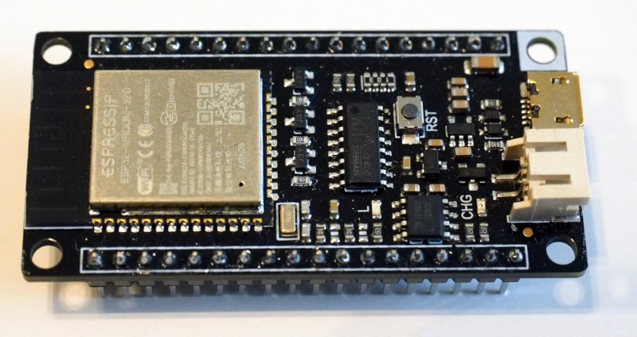

Pins:

  - RX: GPIO16 (labeled 'DI/IO16')
  - TX: GPIO17 (labeled 'LRCK/IO17')
  - RST: pin 1 on header left of the Micro-USB socket (ESP32-chip facing down)

Wemos D1 Mini ESP32
-------------------

The "Wemos D1 Mini ESP32" is officially discontinued, but you will find
various clones of this small board.

It uses an ESP32-WROOM-32 and is relatively small. It works fine with
the factory firmware for the ESP32-WROOM-32.

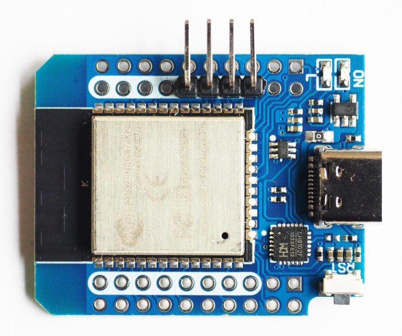

Pins:

  - RX: GPIO16 (labeled 'IO16')
  - TX: GPIO17 (labeled 'IO17')
  - RST: top left inner pin (ESP32-chip facing up, USB-C facing down)

Notes:

  - **Never power the board from USB if connected to the main MCU**.
  - Powering by 3V3 might or might not work. This depends how stable
    the 3V3 line of the main MCU is and how much current it can provide.
  - The board supports a single 1x4 header for IO17/IO16/GND/VCC (see image).

ESP-01S
-------

A very common, but old board based on the ESP8266. There are two restrictions
with the old v2.x.x.x ESP-AT-version:

  - the AT-firmware does not support SSL-mode for servers
  - wifi cannot be disabled (`wifi.radio.enabled` always returns true and
    the setter is a noop)

Because of these restrictions, the device is not fully recommended. But it
will work fine for most client and simple server use cases. Otherwise,
replace the ESP-01S with the compatible Lilygo T-01-C3.

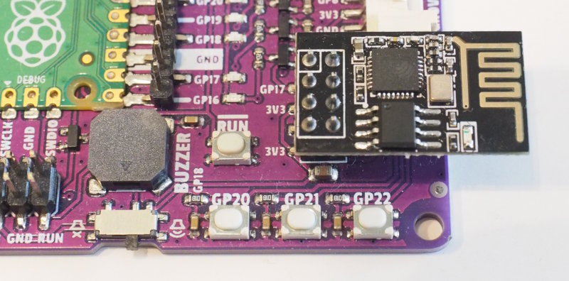

(in the image you can see the [Maker Pi Pico
Board](https://www.cytron.io/c-development-tools/c-maker-series/p-maker-pi-pico-simplifying-raspberry-pi-pico-for-beginners-and-kits)
from Cytron, which has a socket made for the ESP-01S - very nice!).

The big advantage of this board is it's very low price and the small
form-factor.

Pins (2x4 header):

  - RX: GPIO3 (labeled 'RXD', pin 4)
  - TX: GPIO1 (labeled 'TXD', pin 5)
  - RST: pin 7
  - GPIO2: pin 2
  - CH_PD: pin 6
  - GPIO0: pin 3 (-> onboard LED, active low)

Espressif does not release a pre-built firmware for ESP8266-devices
anymore, so you have to build your own firmware. See [ESP-01S
Firmware Compile Guide](./at_firmware_compile_esp01s.md) for details.
